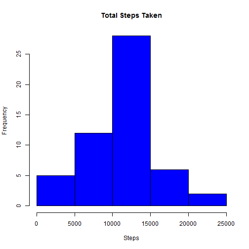
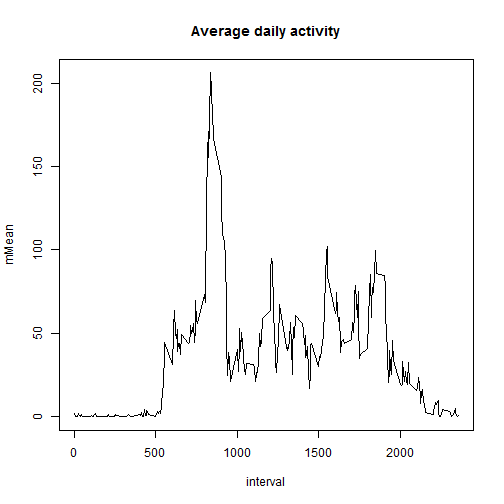
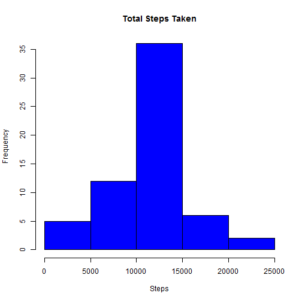
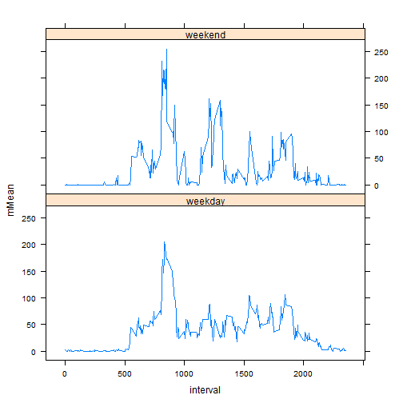

-# Reproducible Research: Peer Assessment 1
+---
+title: "Reproducible Research: Peer Assessment 1"
+output:  html_document:
   keep_md: true
+---
=====================================================


## Loading and preprocessing the data 
This is my research with using the knitr package to generate reproducible research. This assignment makes use of data from a personal activity monitoring device. This device collects data at 5 minute intervals through out the day. The data consists of two months of data from an anonymous individual collected during the months of October and November, 2012 and include the number of steps taken in 5 minute intervals each day.
The data for this assignment can be downloaded from the course web site: Dataset: Activity monitoring data [52K]

The variables included in this dataset are:

steps: Number of steps taking in a 5-minute interval (missing values are coded as NA)

date: The date on which the measurement was taken in YYYY-MM-DD format

interval: Identifier for the 5-minute interval in which measurement was taken

We load and preprocess the data making it suitable for analysis. The data comes in a .csv file format. Basically some missing data is coded as NA in downloaded file, we will omit those rows for the initial analysis.


```r
library(data.table)
library(graphics)
library(grDevices)
library(lattice)
library(plyr)
library(ggplot2)

rawData <- read.csv("activity.csv", na.strings=NA)
naOmittedData <- na.omit(rawData)
```


## What is mean total number of steps taken per day?

We show below a histogram of the total steps taken for the days for which we have data. 
Excluding the NA values, the mean and the median number of steps per day is shown below.


```r
sumData <- ddply(naOmittedData, .(date), summarise, mSum=sum(steps))
with (sumData, hist(mSum, col="blue", main="Total Steps Taken", xlab="Steps"))
```

 

```r
mSteps <- mean(sumData$mSum)
mnSteps <- median(sumData$mSum)
```

The mean number of steps is 1.0766189 &times; 10<sup>4</sup> and the median number of steps is 10765.

## What is the average daily activity pattern? 

The graph below shows the average daily activity for days when we have data


```r
meanData <- ddply(naOmittedData, .(interval), summarize, mMean=mean(steps))
with(meanData, plot(interval, mMean, type="l", main="Average daily activity"))
```

 


Let's see Which 5-minute interval, on average across all the days in the dataset, contains the maximum number of steps.This is shown below


```r
maxSteps <- max(meanData$mMean)
meanData$interval[which(meanData$mMean == maxSteps)]
```

```
## [1] 835
```

## Inputing missing values. 

Since we eliminated rows with missing values in our earlier analysis, we will try replacing the missing values in rawData with the mean from the above analysis. The number of missing values in the data set is 

2304


We will use the mean values from the matching intervals in the above meanData set to replace the NAs in the rawData set.


```r
filleddata <- data.frame(interval=rawData$interval, steps=ifelse(is.na(rawData$steps),meanData[match(meanData$interval, rawData$interval), 2], rawData$steps),date=rawData$date)
```

##Plot the new summary data with NAs replaced by mean for the interval. 
The plot shows the effect of replacing NAs with mean values, there are many more days when the average number of steps were between 10,000 and 15,000. 


```r
newSummaryData <- ddply(filleddata, .(date), summarise, mSum=sum(steps))
with(newSummaryData, hist(mSum, col="blue", main="Total Steps Taken", xlab="Steps"))
```

 

Since I used the mean for that interval from the entire data set to replace the NAs, the new mean and median are the SAME as shown below.
The new mean is 1.0766189 &times; 10<sup>4</sup>
and the new median is 1.0766189 &times; 10<sup>4</sup> which happen to be equal.


## Are there differences in activity patterns between weekdays and weekends? 
The following graph indicates that there are more steps during weekdays as indicated by the red trend line towards evenings, and then there is similar pattern during the rest of the intervals.  


```r
days <- weekdays(as.Date(filleddata$date)) %in% c('Saturday','Sunday')
filleddata$weekday <- factor(days, labels = c("weekday", "weekend"))
avfilledData <- ddply(filleddata, .(interval,weekday), summarize, mMean=mean(steps))
xyplot(mMean~interval|weekday, data=avfilledData, lty=1,type="l", layout=c(1,2))
```

 

Conclusion of research paper
